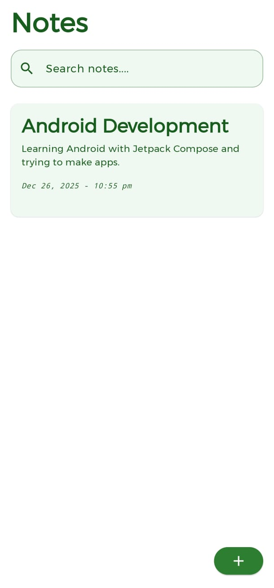
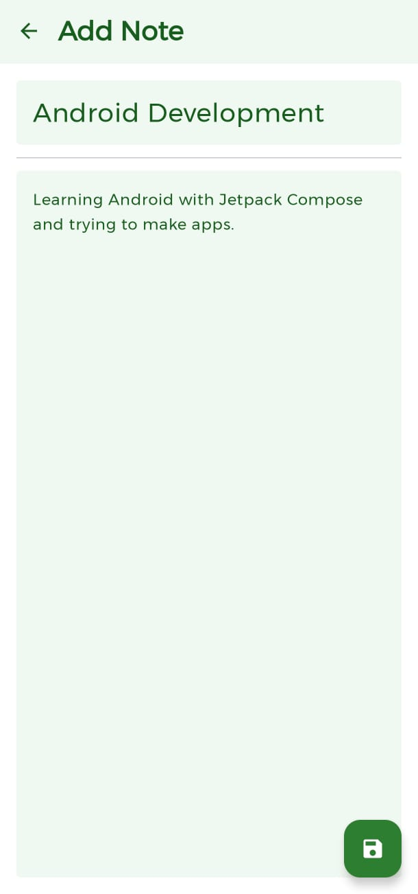

# 📝 Notes App (Android)

A simple and efficient **Android Notes application** built using **Kotlin**.  
The app allows users to **create, edit, delete, and search notes**, with all data stored locally to provide **fast and reliable offline access**.

---

## ✨ Features

- Create new notes  
- Edit existing notes  
- Delete notes  
- Search notes instantly  
- Offline storage (no internet required)  
- Clean and minimal user interface  

---

## 🛠 Tech Stack

- **Language:** Kotlin  
- **Database:** Room Database  
- **UI:** Jetpack Compose  
- **Android Components:**
  - ViewModel  
  - LiveData / State  
  - RecyclerView / LazyColumn  

## 📸 App Screenshots

  
  

